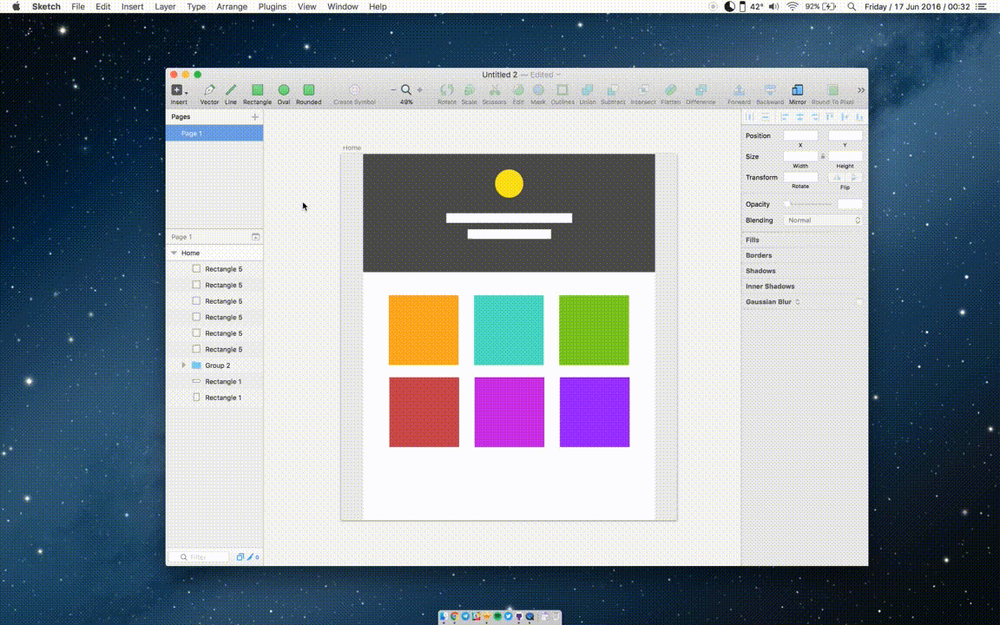

# Preview in browser
A Sketch.app plugin to properly view your design in browser.



### What does this plugin do?

1. View your artboard in browser, with proper scrolling - unlike Sketch Mirror's web preview feature.

2. Your design will be aligned to the center of the browser. The background color on the empty spaces will be the same as the background color of your artboard

3. Your artboard will be automatically scaled up to @2x for better preview on retina displays. (Provided that you design in @1x 😬)

### How to use this plugin?
1. [Download the plugin](https://github.com/gaddafirusli/Preview-in-browser/archive/master.zip)
2. Double-click on the "```Preview in Browser.sketchplugin```"
3. Click on the artboard you'd like to view in browser
4. Use the keyboard shortcut  ```Cmd+Shift+.``` to open it in the browser (You'll have to do this on every changes as this is not a live preview of your artboard)
5. ¯\_(ツ)_/¯

### Contact
Have any suggestions or feedbacks? Hit me up on Twitter [@gaddafirusli](http://www.twitter.com/gaddafirusli)
